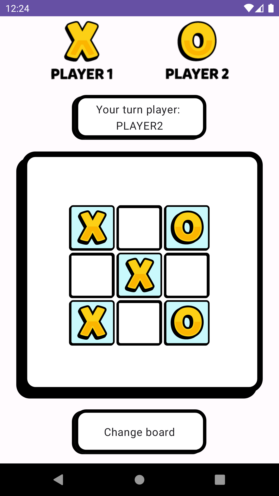
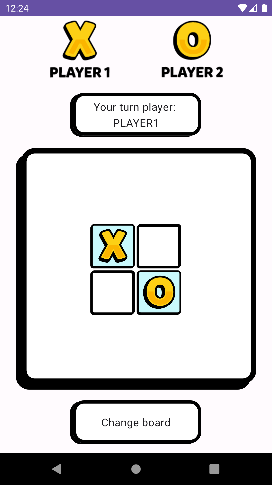
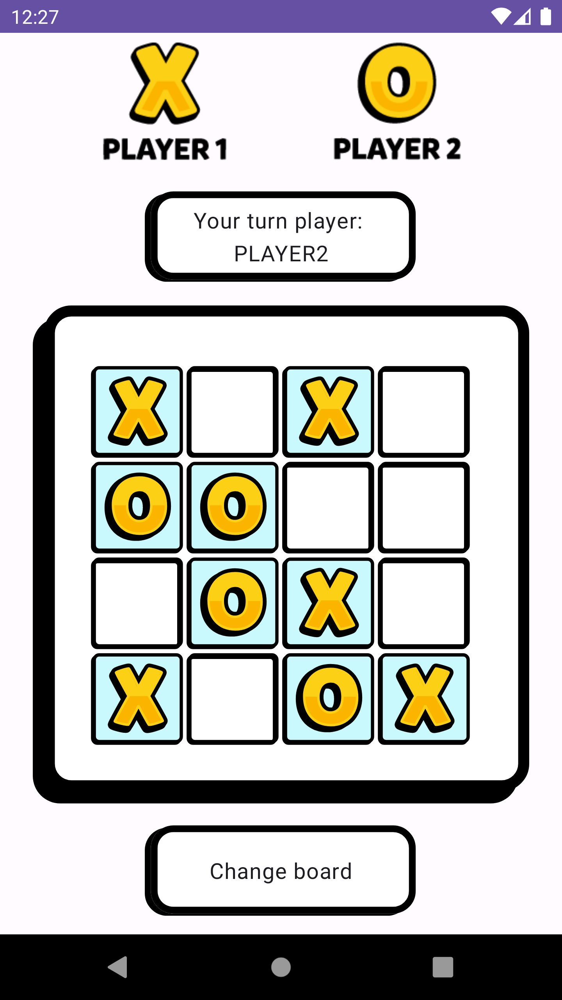
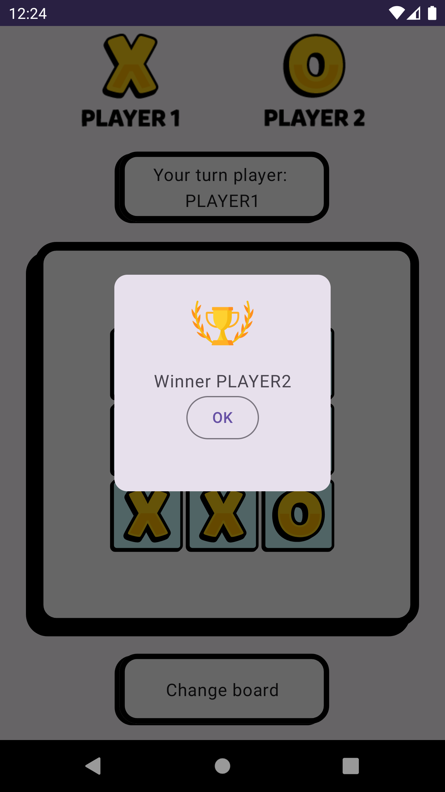

# Tic-Tac-Toe Game

## Introduction
Welcome to this Tic-Tac-Toe game! This application is crafted with several key features:
- **Programming Language**: Developed using Kotlin, known for its efficiency and clarity in Android development.
- **Architectural Pattern**: Its implemented the Model-View-ViewModel (MVVM) pattern. This ensures a robust structure, separating the logic and UI components.
- **User Interface**: Created with Jetpack Compose, offering a modern and interactive experience.
- **State Management**: Efficient handling of game states to ensure smooth gameplay.

The game's logic is built on a flexible array structure, accommodating different board sizes:
- 2x2
- 3x3
- 4x4

The design inspiration comes from a [figma template](https://www.figma.com/community/file/893942075601804557), with all rights attributed to the original designer. Please note, this app is purely for educational purposes and is not intended for commercial release.

## Screenshots
|demo | 3x3 | 2x2 |
|--|--|--|
|  |  |  |
## Screenshots
| 4x4 | winner | splash |
|--|--|--|
|  |  |   |

## Requirements
- Android SDK
- Kotlin
- Jetpack Compose
- MVVM Architecture

## How to Run
1. Clone the repository to your local machine.
2. Open the project in Android Studio.
3. Run the application on an emulator or physical device.

## Used Libraries
- Jetpack Compose: For building the UI.
- ViewModel: Part of Android Jetpack, used for managing UI-related data in a lifecycle-conscious way.
